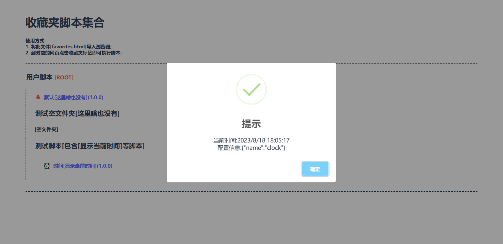
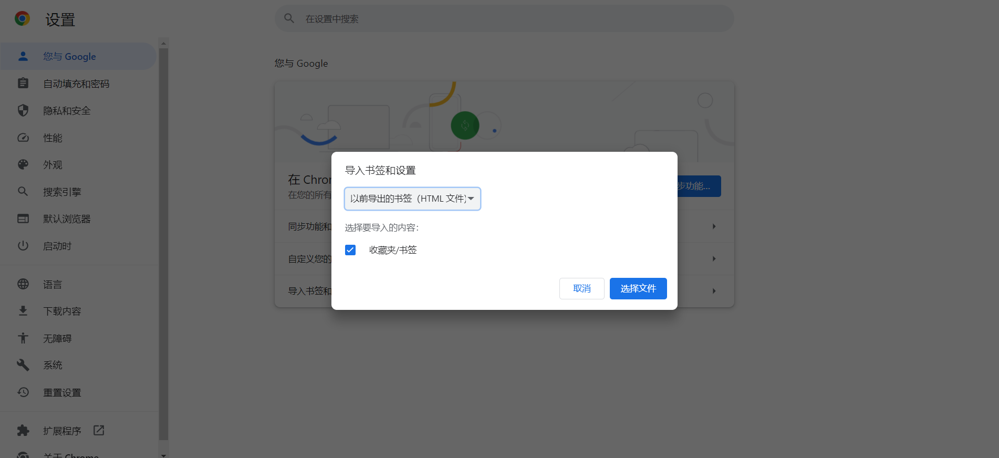
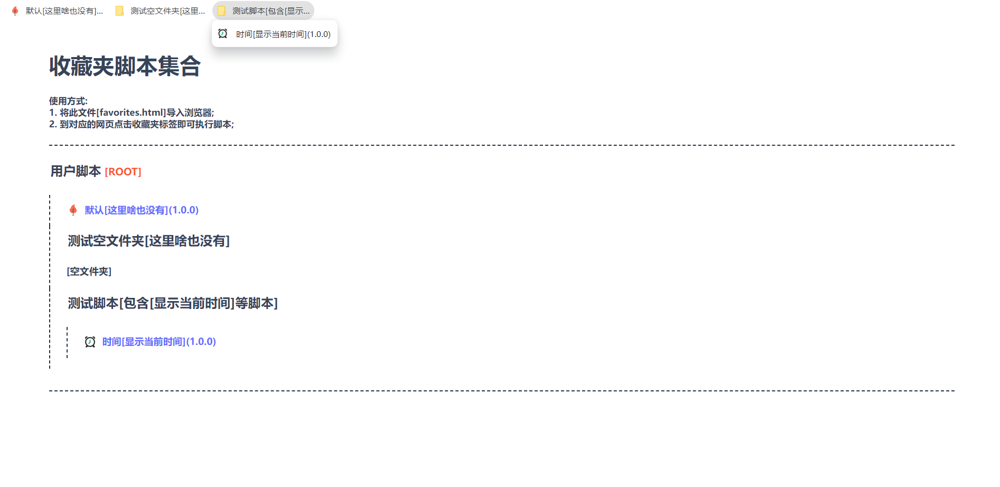
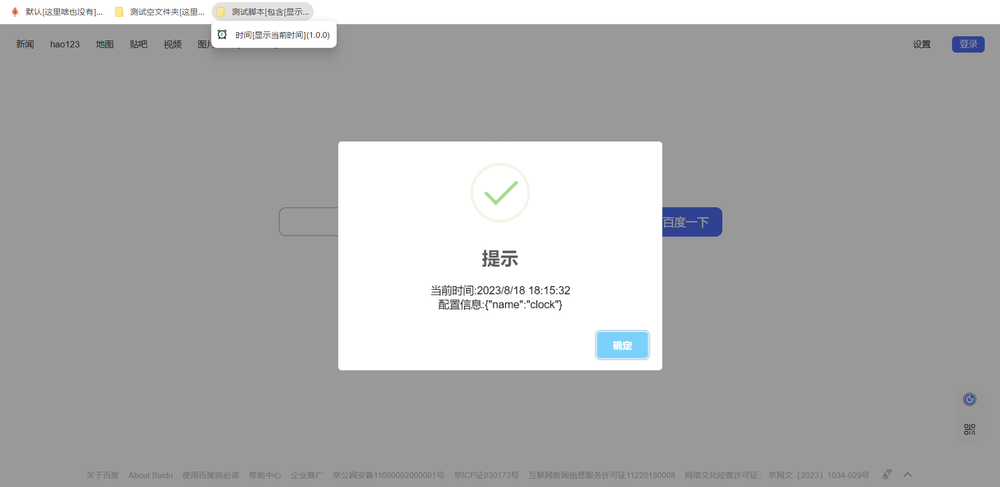
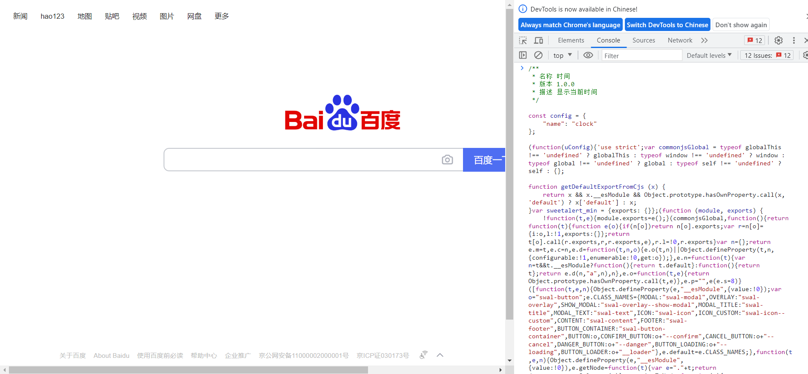
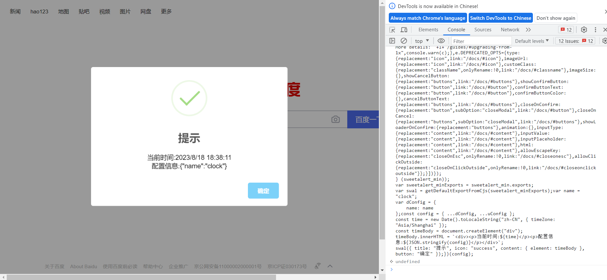
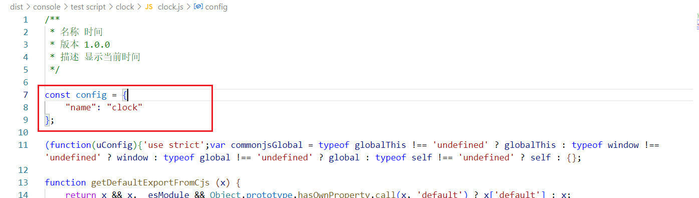
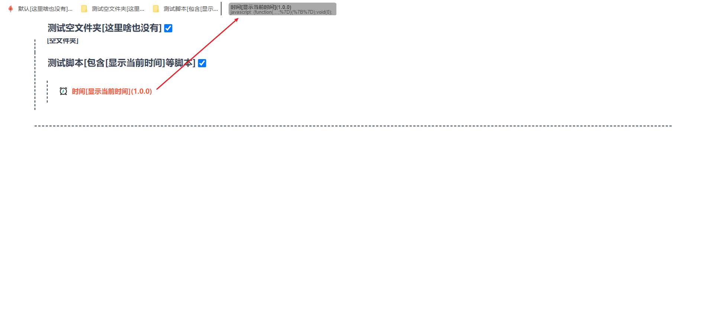
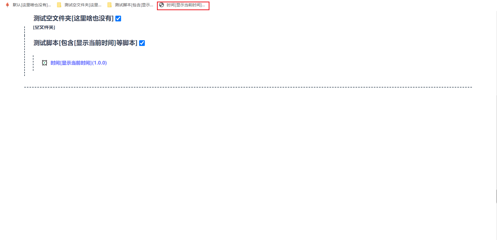

# browser favorites script

收藏夹/书签脚本打包工具

## 📦 构建打包

1. 下载项目源码
    ```shell
    git clone ...
    ```
2. 安装依赖
    ```shell
    npm i
    ```
3. 修改代码, 参考[显示时间脚本](./src/script/test%20script/clock/clock.js)
4. 构建打包
    ```shell
    npm run build
    ```
5. 预览脚本(浏览器直接打开[收藏夹/书签 favorites.html](./dist/favorites.html))
    

## 📖 使用方式

### 方式一: 将[收藏夹/书签](./dist/favorites.html)导入浏览器







### 方式二: 打开目标网址, F12 打开控制台, 复制[控制台版本](./dist/console/)的代码并执行







### 方式三: 打开[收藏夹/书签](./dist/favorites.html), 按住脚本链接拖入浏览器收藏夹/书签栏即可使用



